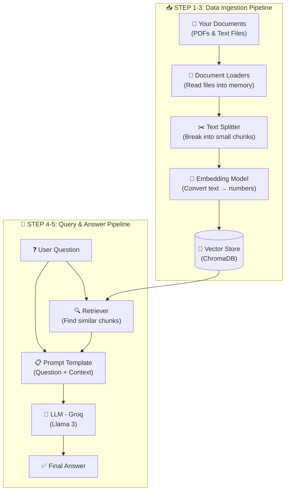

# 🧠 Traditional RAG — A Crash Course for Beginners

> **Learn how to build a Retrieval-Augmented Generation (RAG) pipeline from scratch using Python, LangChain, ChromaDB and Groq.**

If you've ever wondered *"How do chatbots answer questions about MY documents?"* — this project is for you. By the end of this crash course you will understand every piece of a traditional RAG pipeline and be able to build one yourself.

---

## 📖 Table of Contents

1. [What is RAG? (The Big Picture)](#-what-is-rag-the-big-picture)
2. [How This Project Works — Architecture](#-how-this-project-works--architecture)
3. [Tech Stack](#-tech-stack)
4. [Project Structure](#-project-structure)
5. [Getting Started (Step-by-Step)](#-getting-started-step-by-step)
6. [Pipeline Walkthrough](#-pipeline-walkthrough)
   - [Step 1 — Data Ingestion](#step-1--data-ingestion-loading-your-documents)
   - [Step 2 — Text Chunking](#step-2--text-chunking-breaking-documents-into-pieces)
   - [Step 3 — Embeddings & Vector Store](#step-3--embeddings--vector-store-making-text-searchable)
   - [Step 4 — Retriever](#step-4--retriever-finding-relevant-chunks)
   - [Step 5 — LLM Integration](#step-5--llm-integration-generating-the-answer)
7. [Full Working Code](#-full-working-code)
8. [Key Concepts Glossary](#-key-concepts-glossary)
9. [What's Next?](#-whats-next)
10. [Support & Engagement](#%EF%B8%8F-support--engagement-%EF%B8%8F)

---

## 🤔 What is RAG? (The Big Picture)

**RAG (Retrieval-Augmented Generation)** is a technique that makes Large Language Models (LLMs) smarter by giving them access to **your own data** before they answer a question.

### The Problem
LLMs like ChatGPT or Llama are trained on public internet data. They **don't know** about:
- Your company's internal documents 📄
- Your personal notes 📝
- Any PDF or file on your computer 💻

### The Solution — RAG!
Instead of retraining the entire model (which is expensive and slow), RAG works in **two simple steps**:

1. **Retrieve** → Find the most relevant pieces of information from your documents.
2. **Generate** → Feed those pieces to the LLM along with the user's question, so it can generate an accurate, grounded answer.

> 💡 **Think of it like an open-book exam** — the LLM gets to look at your notes before answering!

---

## 🏗️ How This Project Works — Architecture

Here's the full picture of what happens when you run this pipeline:



---

## 🧰 Tech Stack

Here's what we're using and **why** — all tools are beginner-friendly:

| Tool | What It Does | Why We Use It |
|------|-------------|---------------|
| **Python 3.12+** | Programming language | Easy to read and learn |
| **LangChain** | RAG framework | Simplifies connecting loaders, splitters, LLMs |
| **ChromaDB** | Vector database | Stores embeddings locally, no server needed |
| **Sentence-Transformers** | Embedding model | Converts text to vectors locally (free!) |
| **Groq** | LLM API provider | Ultra-fast Llama 3 inference (free tier available) |
| **PyPDF / PyMuPDF** | PDF reader | Extracts text from PDF files |
| **python-dotenv** | Environment variables | Keeps your API keys safe |

---

## 📁 Project Structure

```
rag-data-ingestion-pipeline/
│
├── 📂 data/
│   ├── 📂 pdfs/                  ← Drop your PDF files here
│   ├── 📂 text_files/            ← Drop your .txt files here
│   └── 📂 vector_store/          ← ChromaDB saves embeddings here (auto-generated)
│
├── 📂 notebook/
│   └── 📓 document.ipynb         ← Jupyter notebook to experiment step-by-step
│
├── 🐍 main.py                    ← Run this to execute the full pipeline
├── 🔐 .env                       ← Your API keys (never commit this!)
├── 📦 pyproject.toml              ← Project dependencies
├── 📋 requirements.txt            ← Pip-compatible dependency list
└── 📖 README.md                   ← You are here!
```

---

## 🚀 Getting Started (Step-by-Step)

### Prerequisites

- **Python 3.12 or higher** → [Download Python](https://www.python.org/downloads/)
- **A Groq API Key (free)** → [Get yours at console.groq.com](https://console.groq.com/keys)

### 1️⃣ Clone This Repository

```bash
git clone https://github.com/zees007/traditional-RAG-Crash-Course-for-beginner.git
cd traditional-RAG-Crash-Course-for-beginner
```

### 2️⃣ Create a Virtual Environment

```bash
# Create
python -m venv .venv

# Activate (Windows)
.venv\Scripts\activate

# Activate (macOS / Linux)
source .venv/bin/activate
```

### 3️⃣ Install Dependencies

**Option A — Using `uv` (Recommended, faster):**
```bash
pip install uv
uv sync
```

**Option B — Using `pip`:**
```bash
pip install -r requirements.txt
```

### 4️⃣ Set Up Your API Key

Create a `.env` file in the project root:
```env
GROQ_API_KEY="paste-your-groq-api-key-here"
```

> ⚠️ **Important:** Never share or commit your `.env` file. It's already in `.gitignore` to keep it safe.

### 5️⃣ Add Your Documents

Drop any PDF or text files into the respective folders:
- PDFs → `data/pdfs/`
- Text files → `data/text_files/`

The project already includes sample files to get you started! 🎉

### 6️⃣ Run the Pipeline

```bash
python main.py
```

---

## 🔬 Pipeline Walkthrough

Let's break down each step so you truly understand what's happening under the hood.

---

### Step 1 — Data Ingestion (Loading Your Documents)

> **Goal:** Read raw files (PDFs & text) and convert them into a format Python can work with.

```python
from langchain_community.document_loaders import PyPDFDirectoryLoader, DirectoryLoader, TextLoader

# Load all PDFs from a folder
pdf_loader = PyPDFDirectoryLoader("data/pdfs")
pdf_docs = pdf_loader.load()

# Load all .txt files from a folder
txt_loader = DirectoryLoader("data/text_files", glob="*.txt", loader_cls=TextLoader)
txt_docs = txt_loader.load()

# Combine them
all_docs = pdf_docs + txt_docs
```

**What happens here?**
- `PyPDFDirectoryLoader` reads every PDF in the `data/pdfs/` folder and extracts the text page by page.
- `DirectoryLoader` + `TextLoader` reads every `.txt` file in `data/text_files/`.
- Each loaded file becomes a **LangChain Document** object containing the text (`page_content`) and metadata like filename, page number, etc.

---

### Step 2 — Text Chunking (Breaking Documents into Pieces)

> **Goal:** Split large documents into small, overlapping pieces that fit within the LLM's context window.

```python
from langchain_text_splitters import RecursiveCharacterTextSplitter

text_splitter = RecursiveCharacterTextSplitter(
    chunk_size=1000,       # Each chunk has max 1000 characters
    chunk_overlap=200      # Chunks overlap by 200 characters
)

chunks = text_splitter.split_documents(all_docs)
```

**Why do we chunk?**
- LLMs have a **token limit** — you can't pass an entire 100-page PDF at once.
- Smaller chunks make **retrieval more precise** — finding a relevant paragraph is better than finding a relevant book.

**Why overlap?**
- Overlap ensures that a sentence split across two chunks isn't lost. The end of chunk 1 and the start of chunk 2 share 200 characters, preserving context.

```
Document: "Python is great. It is easy to learn. Many developers love it."

Chunk 1: "Python is great. It is easy to learn."
Chunk 2: "It is easy to learn. Many developers love it."
              ↑ overlap ensures continuity ↑
```

---

### Step 3 — Embeddings & Vector Store (Making Text Searchable)

> **Goal:** Convert text chunks into numerical vectors and store them in a database for fast similarity search.

```python
from langchain_community.embeddings import HuggingFaceEmbeddings
from langchain_community.vectorstores import Chroma

# Load a free, local embedding model
embeddings = HuggingFaceEmbeddings(model_name="all-MiniLM-L6-v2")

# Store chunks as vectors in ChromaDB
vector_store = Chroma.from_documents(
    documents=chunks,
    embedding=embeddings,
    persist_directory="data/vector_store"
)
```

**What are Embeddings?**
- An embedding converts text into a **list of numbers** (a vector) that captures its **meaning**.
- Similar texts produce similar vectors. For example:
  - `"Python is a programming language"` → `[0.12, 0.85, 0.33, ...]`
  - `"Java is a coding language"` → `[0.14, 0.82, 0.31, ...]` ← similar!
  - `"I love pizza"` → `[0.91, 0.02, 0.76, ...]` ← very different!

**What is ChromaDB?**
- It's a **vector database** — think of it like a regular database, but instead of searching by keywords, it searches by **meaning**.
- It saves to disk (`data/vector_store/`), so you don't have to re-process documents every time.

---

### Step 4 — Retriever (Finding Relevant Chunks)

> **Goal:** When a user asks a question, find the most relevant chunks from the vector store.

```python
retriever = vector_store.as_retriever(search_kwargs={"k": 3})

# Example: find 3 most relevant chunks for a query
relevant_docs = retriever.invoke("What is Python?")
```

**How does retrieval work?**
1. The user's question is converted into an embedding (same model as above).
2. ChromaDB compares this embedding against all stored chunk embeddings using **cosine similarity**.
3. The top `k` (in our case 3) most similar chunks are returned.

> 💡 This is the **"R" in RAG** — Retrieval!

---

### Step 5 — LLM Integration (Generating the Answer)

> **Goal:** Send the retrieved context + user question to an LLM and get a grounded answer.

```python
from langchain_groq import ChatGroq
from langchain_core.prompts import ChatPromptTemplate
from langchain.chains import create_retrieval_chain
from langchain.chains.combine_documents import create_stuff_documents_chain

# Initialize the LLM (Groq serves Llama 3 with ultra-fast speed)
llm = ChatGroq(model="llama3-8b-8192", temperature=0.2)

# Create the prompt template
system_prompt = (
    "You are an assistant for question-answering tasks. "
    "Use the following pieces of retrieved context to answer "
    "the question. If you don't know the answer, say that you "
    "don't know.\n\n"
    "Context:\n{context}"
)

prompt = ChatPromptTemplate.from_messages([
    ("system", system_prompt),
    ("human", "{input}"),
])

# Build the RAG chain
question_answer_chain = create_stuff_documents_chain(llm, prompt)
rag_chain = create_retrieval_chain(retriever, question_answer_chain)

# Ask a question!
response = rag_chain.invoke({"input": "What is Python and why is it popular?"})
print(response["answer"])
```

**What happens here?**
1. **Prompt Template** — We tell the LLM: *"Here's some context from the user's documents. Use it to answer their question."*
2. **Groq + Llama 3** — Groq provides blazing-fast inference for open-source models. The free tier is perfect for learning!
3. **RAG Chain** — LangChain connects the retriever and LLM into a single chain: *Question → Retrieve → Generate → Answer*.

> 💡 This is the **"AG" in RAG** — Augmented Generation!

---

## 💻 Full Working Code

Here is the complete pipeline in one file — copy this into `main.py` and run it:

```python
import os
from dotenv import load_dotenv
from langchain_community.document_loaders import PyPDFDirectoryLoader, DirectoryLoader, TextLoader
from langchain_text_splitters import RecursiveCharacterTextSplitter
from langchain_community.embeddings import HuggingFaceEmbeddings
from langchain_community.vectorstores import Chroma
from langchain_groq import ChatGroq
from langchain.chains import create_retrieval_chain
from langchain.chains.combine_documents import create_stuff_documents_chain
from langchain_core.prompts import ChatPromptTemplate

# ──── Configuration ────
load_dotenv()
PERSIST_DIRECTORY = "data/vector_store"
PDF_DIR = "data/pdfs"
TEXT_DIR = "data/text_files"


def run_rag_pipeline():
    # Ensure directories exist
    os.makedirs(PERSIST_DIRECTORY, exist_ok=True)
    os.makedirs(PDF_DIR, exist_ok=True)
    os.makedirs(TEXT_DIR, exist_ok=True)

    # ──── STEP 1: Data Ingestion ────
    print("📖 Loading documents...")
    pdf_loader = PyPDFDirectoryLoader(PDF_DIR)
    txt_loader = DirectoryLoader(TEXT_DIR, glob="*.txt", loader_cls=TextLoader)

    docs = []
    docs.extend(pdf_loader.load())
    docs.extend(txt_loader.load())

    if not docs:
        print("⚠️  No documents found. Add files to data/pdfs/ or data/text_files/")
        return

    # ──── STEP 2: Text Chunking ────
    print(f"✂️  Splitting {len(docs)} document(s) into chunks...")
    text_splitter = RecursiveCharacterTextSplitter(chunk_size=1000, chunk_overlap=200)
    chunks = text_splitter.split_documents(docs)
    print(f"✅ Created {len(chunks)} chunks.")

    # ──── STEP 3: Embeddings & Vector Store ────
    print("🧠 Generating embeddings & saving to ChromaDB...")
    embeddings = HuggingFaceEmbeddings(model_name="all-MiniLM-L6-v2")
    vector_store = Chroma.from_documents(
        documents=chunks,
        embedding=embeddings,
        persist_directory=PERSIST_DIRECTORY,
    )
    print("✅ Vector store ready.")

    # ──── STEP 4: Retriever ────
    retriever = vector_store.as_retriever(search_kwargs={"k": 3})

    # ──── STEP 5: LLM Integration ────
    llm = ChatGroq(model="llama3-8b-8192", temperature=0.2)

    system_prompt = (
        "You are an assistant for question-answering tasks. "
        "Use the following pieces of retrieved context to answer "
        "the question. If you don't know the answer, say that you "
        "don't know.\n\n"
        "Context:\n{context}"
    )
    prompt = ChatPromptTemplate.from_messages([
        ("system", system_prompt),
        ("human", "{input}"),
    ])

    question_answer_chain = create_stuff_documents_chain(llm, prompt)
    rag_chain = create_retrieval_chain(retriever, question_answer_chain)

    # ──── Ask a Question ────
    query = "What is Python and why is it popular?"
    print(f"\n💬 Question: '{query}'")

    response = rag_chain.invoke({"input": query})
    print(f"\n💡 Answer:\n{response['answer']}")


if __name__ == "__main__":
    run_rag_pipeline()
```

---

## 📚 Key Concepts Glossary

| Term | Simple Explanation |
|------|--------------------|
| **RAG** | Retrieve relevant info from your docs, then let the LLM generate an answer using it |
| **Embedding** | A list of numbers that represents the *meaning* of a piece of text |
| **Vector Store** | A database that stores embeddings and lets you search by meaning (not keywords) |
| **Chunk** | A small piece of a document (e.g., a paragraph) |
| **Retriever** | The component that finds the most relevant chunks for a given question |
| **LLM** | Large Language Model — the AI that generates human-like text responses |
| **Prompt Template** | A pre-written instruction that tells the LLM how to behave and what context to use |
| **LangChain** | A Python framework that makes it easy to build LLM-powered applications |
| **ChromaDB** | An open-source vector database that runs locally on your machine |
| **Groq** | A cloud API that runs open-source LLMs (like Llama 3) at extremely high speed |

---

## 🚀 What's Next?

Once you're comfortable with this traditional RAG pipeline, explore these topics:

- 🔄 **Conversational RAG** — Add chat history so the LLM remembers previous questions
- 📊 **Advanced Chunking** — Try semantic chunking or document-aware splitting
- 🌐 **Web Search Integration** — Use Tavily to search the web alongside your documents
- 🏗️ **Agentic RAG** — Let the LLM decide *when* to retrieve and *what tools* to use
- ☁️ **Cloud Vector Stores** — Scale up with Pinecone, Weaviate, or Qdrant

---

<h1 align="center">❤️ Support & Engagement ❤️</h1>

⭐ If you find this project helpful, please give it a star on [GitHub](https://github.com/zees007/traditional-RAG-Crash-Course-for-beginner)!

⭐ If you find this article informative and beneficial, please consider showing your appreciation by giving it a clap 👏👏👏, highlight it and replying on my story. Feel free to share this article with your peers. Your support and knowledge sharing within the developer community are highly valued.

⭐ Please share on social media

⭐ Follow me on : [Medium](https://medium.com/@mhmdzeeshan) || [LinkedIn](https://www.linkedin.com/in/zeeshan-adil-a94b3867/) || [X (Formerly Twitter)](https://x.com/DevZeesCraft)

⭐ Check out my work, projects, and more on my [Linktree](https://linktr.ee/zees007)

⭐ [Check out my other articles on Medium](https://medium.com/@mhmdzeeshan)

⭐ [Subscribe to my newsletter 📧](https://medium.com/@mhmdzeeshan/subscribe), so that you don't miss out on my latest articles.

⭐ If you enjoyed my article, please consider [buying me a coffee ❤️](https://buymeacoffee.com/mhmdzeeshan) and stay tuned to more articles about java, technologies and AI. 🧑‍💻

---

<h2 align="center">👨‍💻 Author</h2>

<p align="center">
  <strong>Zeeshan</strong><br/>
  🌍 Full-stack AI Developer | Python | Java | Spring Boot | Flutter | Agentic AI | RAG | LangChain | Generative AI
</p>
