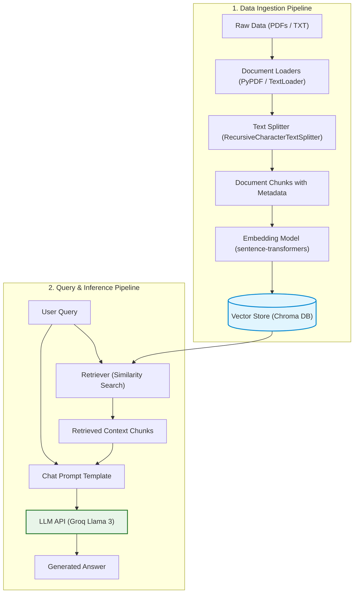

# 🧠 Traditional RAG Pipeline (Data Ingestion & Retrieval)

This repository contains a clean, robust, and extensible implementation of a **Traditional Retrieval-Augmented Generation (RAG)** pipeline. Built with **LangChain**, **Chroma DB**, **Sentence-Transformers**, and **Groq**, this pipeline enables efficient ingestion of documents (PDFs and Text files), local semantic indexing, and high-performance context-aware query answering.

---

## 🏗️ Architecture Flow



---

## ⚡ Features

- **Document Loading & Processing**: Out-of-the-box support for reading plain text (`.txt`) and PDF files (`.pdf`) using `PyPDF` and `PyMuPDF`.
- **Intelligent Text Chunking**: Chunking strategy utilizing `RecursiveCharacterTextSplitter` with configurable chunk size and overlap to preserve semantics and context boundaries.
- **Local Semantic Embeddings**: Offloads embedding generation locally using `sentence-transformers` (such as `all-MiniLM-L6-v2`), avoiding external API costs for vectorization.
- **Vector Database**: Persists vector indexes locally via `Chroma DB`, enabling fast similarity searches and filtered metadata retrieval.
- **Ultra-fast LLM Inference**: Integrated with **Groq Cloud API** using `langchain-groq` to harness high-speed open LLMs (like Llama 3) for final response generation.
- **Flexible Environment Configuration**: Utilizes dotenv configuration for easy API key and filepath management.

---

## 📁 Repository Structure

```text
rag-data-ingestion-pipeline/
│
├── data/
│   ├── pdfs/                 # Raw PDF files to ingest
│   ├── text_files/           # Plain text files
│   └── vector_store/         # Local persistent Chroma DB storage
│
├── notebook/
│   └── document.ipynb        # Jupyter notebook demonstrating ingestion steps
│
├── main.py                   # Main entry point to run the RAG flow
├── .env.example              # Example environment variables file
├── pyproject.toml            # Project configurations and dependency declarations
└── README.md                 # Project documentation (this file)
```

---

## ⚙️ Setup & Installation

### 1. Prerequisites
Ensure you have **Python 3.12+** installed on your system. Using a package manager like [uv](https://github.com/astral-sh/uv) is highly recommended for faster setup.

### 2. Clone the Repository
```bash
git clone https://github.com/yourusername/rag-data-ingestion-pipeline.git
cd rag-data-ingestion-pipeline
```

### 3. Install Dependencies
Choose one of the methods below:

**Using `uv` (Recommended):**
```bash
uv sync
```

**Using `pip`:**
```bash
pip install -r requirements.txt
```

### 4. Configure Environment Variables
Create a `.env` file in the root directory:
```bash
cp .env.example .env
```
Open `.env` and fill in your keys:
```env
GROQ_API_KEY="your-groq-api-key-here"
TAVILY_API_KEY="your-tavily-api-key-here"  # Optional, if using search tools
```

---

## 🚀 How to Run the Pipeline

Below is a complete implementation that you can write to [main.py](file:///d:/Projects/Python%20Projects/RAG%20Applications/rag-data-ingestion-pipeline/main.py) to run the full RAG pipeline:

```python
import os
from dotenv import load_dotenv
from langchain_community.document_loaders import PyPDFDirectoryLoader, DirectoryLoader, TextLoader
from langchain_text_splitters import RecursiveCharacterTextSplitter
from langchain_community.embeddings import HuggingFaceEmbeddings
from langchain_community.vectorstores import Chroma
from langchain_groq import ChatGroq
from langchain.chains import create_retrieval_chain
from langchain.chains.combine_documents import create_stuff_documents_chain
from langchain_core.prompts import ChatPromptTemplate

# 1. Load Configurations
load_dotenv()
PERSIST_DIRECTORY = "data/vector_store"
PDF_DIR = "data/pdfs"
TEXT_DIR = "data/text_files"

def run_rag_pipeline():
    # Make sure data directories exist
    os.makedirs(PERSIST_DIRECTORY, exist_ok=True)
    os.makedirs(PDF_DIR, exist_ok=True)
    os.makedirs(TEXT_DIR, exist_ok=True)

    print("📖 Loading documents...")
    # Load PDFs and Text files
    pdf_loader = PyPDFDirectoryLoader(PDF_DIR)
    txt_loader = DirectoryLoader(TEXT_DIR, glob="*.txt", loader_cls=TextLoader)
    
    docs = []
    docs.extend(pdf_loader.load())
    docs.extend(txt_loader.load())
    
    if not docs:
        print("⚠️ No documents found in data folders. Please add files to proceed.")
        return

    print(f"✂️ Splitting {len(docs)} document pages/files...")
    # 2. Split documents into chunks
    text_splitter = RecursiveCharacterTextSplitter(chunk_size=1000, chunk_overlap=200)
    chunks = text_splitter.split_documents(docs)
    print(f"✅ Created {len(chunks)} text chunks.")

    print("🧠 Generating embeddings and storing in Chroma DB...")
    # 3. Initialize local Embedding Model
    embeddings = HuggingFaceEmbeddings(model_name="all-MiniLM-L6-v2")
    
    # 4. Store in Chroma DB
    vector_store = Chroma.from_documents(
        documents=chunks,
        embedding=embeddings,
        persist_directory=PERSIST_DIRECTORY
    )
    print("✅ Vector database saved locally.")

    # 5. Define Retriever
    retriever = vector_store.as_retriever(search_kwargs={"k": 3})

    # 6. Initialize Groq LLM
    llm = ChatGroq(
        model="llama3-8b-8192",
        temperature=0.2,
    )

    # 7. Create Prompt Template
    system_prompt = (
        "You are an assistant for question-answering tasks. "
        "Use the following pieces of retrieved context to answer "
        "the question. If you don't know the answer, say that you "
        "don't know.\n\n"
        "Context:\n{context}"
    )
    prompt = ChatPromptTemplate.from_messages([
        ("system", system_prompt),
        ("human", "{input}"),
    ])

    # 8. Setup Chains
    question_answer_chain = create_stuff_documents_chain(llm, prompt)
    rag_chain = create_retrieval_chain(retriever, question_answer_chain)

    # 9. Query example
    query = "What is Python and why is it popular?"
    print(f"\n💬 Querying: '{query}'")
    
    response = rag_chain.invoke({"input": query})
    print("\n💡 Response:")
    print(response["answer"])

if __name__ == "__main__":
    run_rag_pipeline()
```

---

## 🛠️ Pipeline Details

### 1. Data Ingestion & Splitting
- **Loaders**: `DirectoryLoader` dynamically finds and loads raw information.
- **Text Chunking**: Standard character length of `1000` with `200` overlap ensures sentences aren't cut in half blindly and maintains context across chunk boundaries.

### 2. Embeddings & Retrieval
- **Local Embeddings**: The `all-MiniLM-L6-v2` transformer embeds text chunks into a 384-dimensional vector space.
- **Semantic Search**: Submits queries to the vector store to run cosine similarity comparisons, returning top-k matching documents.

### 3. LLM Integration
- **Context Injection**: Retrieved texts are packed into prompt variables.
- **Llama 3 Model**: Groq serves the highly performant `llama3-8b-8192` model with minimal latency, returning contextually grounded answers back to the user.
